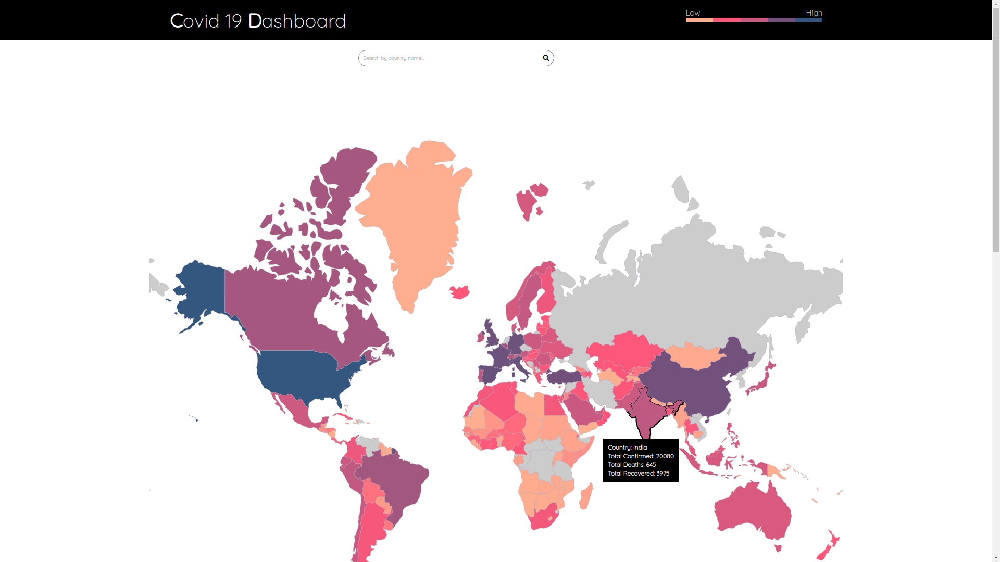
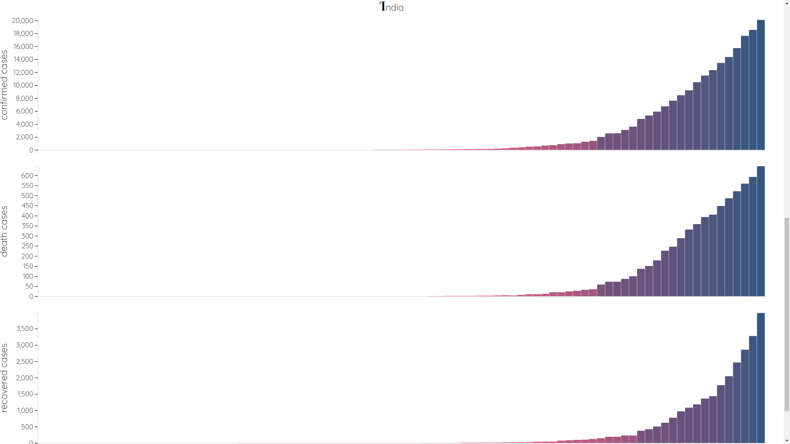

# COVID-19 Dashboard

*"There's only, but respect to The Frontline Fighters in War Against Covid-19. These are hard times but we as humanity stand united."*

I've implemented a **COVID 19 Dashboard** for country wise statistics about cases that are realtime updated. This project is a part of my participation in an event **[Kanvas'20](http://gawds.in/kanvas/)** organised by **GAWDS, National Institute of Technology, Kurukshetra**.

#### [Website Link](https://palak001.github.io/COVID-19-Dashboard/) 

I've used the following API's-

World map data: https://cdn.jsdelivr.net/npm/world-atlas@2/countries-110m.json \
Total Countrywise data: https://api.covid19api.com/summary \
Daily Countrywise data: https://pomber.github.io/covid19/timeseries.json 

The graphs and maps are implemented using D3.js

Have a glimpse of what I've been working on...

I've provided further functionality to search a particular country to see it's respective statistics. And the website is fully responsive. 

## Problems Faced
There have been some error in API's, like it's not returning data for some countries, so their respective graphs are not displayed.

## Suggestions
More suggestions and improvements are welcomed.
